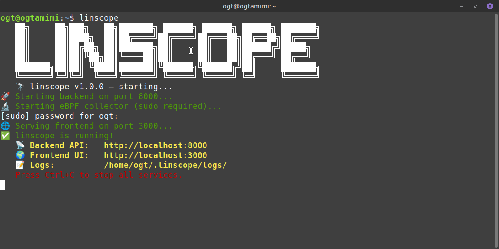
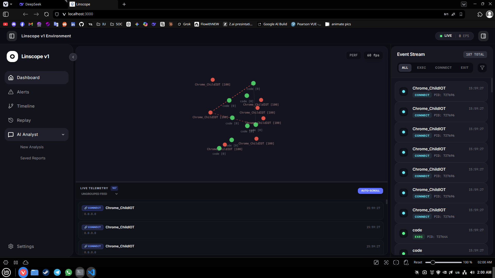
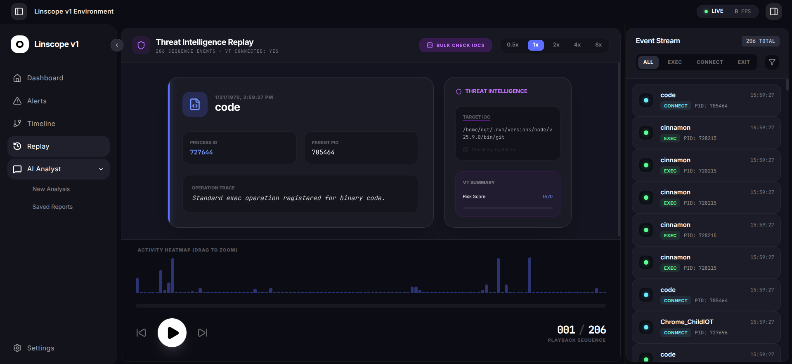
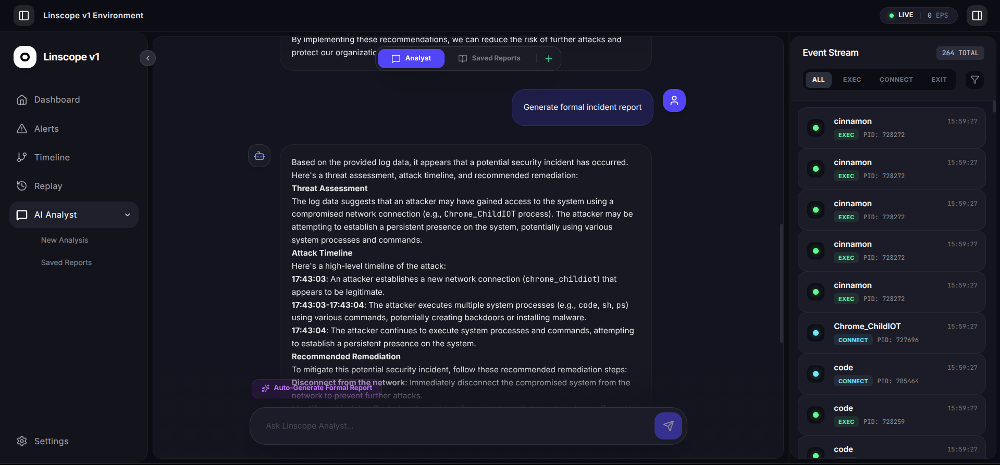

<div align="center">

# 🔭 LINSCOPE

**Real-time behavioral observability platform for Linux**

*See what's happening inside your Linux system as a living security graph*

[](LICENSE)
[]()
[]()
[]()
[]()
[]()
[]()

</div>

---

## ✨ What is linscope?

linscope transforms Linux kernel activity into a **live visual behavioral system**.

Instead of drowning in logs, you see:

- 🔴 **Live process graphs** — who spawned what, when, and why
- 🌐 **Network flow maps** — real-time connection visualization
- ⚡ **Behavioral anomaly detection** — not signature-based
- 🎬 **Attack replay** — reconstruct incidents step by step
- 🤖 **AI-powered analysis** — local LLM for incident explanation

> Built for SOC analysts, pentesters, and security researchers.


## 🏗️ Architecture

```text
eBPF Collector  →  FastAPI Backend  →  WebSocket  →  React Frontend
      ↓                 ↓                 ↓                ↓
Kernel Event      Real-time          Live Graph      Visualization
   Stream         Processing           Updates
      ↓
Detection Engine  →  Replay Engine  → AI Assistant
```

---

## 📦 Install from Debian package

If you have the packaged installer `linscope_v1_amd64.deb`, install it with:

```bash
sudo dpkg -i linscope_v1_amd64.deb
sudo apt-get install -f
```

After the package installs, run the application using the installed binary or service. For example:

```bash
linscope
```

If the command is not available, follow the regular source-based startup instructions in the Quick Start section below.

---

## 🚀 Quick Start

### Prerequisites
- Linux (Ubuntu 22.04+, Mint 21+)
- Python 3.10+
- Node.js 18+
- Root access for the collector
- eBPF dependencies: `bpfcc-tools`, `python3-bpfcc`, `linux-headers-$(uname -r)`, `bpftrace`
- Optional: local Ollama for AI analysis

### Install required packages

```bash
cd linscope
sudo apt update
sudo apt install -y bpfcc-tools python3-bpfcc linux-headers-$(uname -r) bpftrace
python3 -m venv venv
source venv/bin/activate
pip install -r requirements.txt
```

> `npm install` is independent of the Python virtual environment.

```bash
cd linscope/frontend
npm install
```

### Optional: install Ollama for local AI

If you want the AI Analyst and incident analysis features to work locally, install Ollama and start its local server.

```bash
# Follow Ollama install instructions from https://ollama.com/docs/installation
curl -fsSL https://ollama.com/install.sh | sudo bash
```

Then start the Ollama API server:

```bash
ollama serve --port 11434
```

By default, linscope will use `http://localhost:11434` for Ollama.
You can override this with `OLLAMA_URL=http://localhost:11434` in your environment.

### Optional: VirusTotal integration
If you want VirusTotal IOC lookups, run:

```bash
bash setup-virustotal.sh
```

Then set your `VIRUSTOTAL_API_KEY` in `.env.example` or a local `.env` file.

### Running linscope

**Terminal 1 — Backend**
```bash
cd linscope/backend
python3 -m uvicorn main:app --reload --port 8000
```

**Terminal 2 — Collector**
```bash
cd linscope/collector
sudo PYTHONPATH=/usr/lib/python3/dist-packages python3 main.py
```

**Terminal 3 — Frontend**
```bash
cd linscope/frontend
npm run dev
```

Open http://localhost:3000 🔭

---

## 🎯 Features

| Feature | Status | Description |
| :--- | :--- | :--- |
| Process Monitoring | ✅ | eBPF process exec/fork/exit events |
| Network Monitoring | ✅ | `NetworkMonitorV2` with `/proc/net/tcp` fallback |
| File Syscall Monitoring | ✅ | Experimental open/unlink tracking |
| Live Graph | ✅ | Real-time behavioral graph rendering |
| Timeline View | ✅ | Zoom, search, PID filter |
| Replay Engine | ✅ | Speed control and seek |
| Detection Engine | ✅ | Rule-based MITRE-style detection |
| Alerts Panel | ✅ | Real-time alert streaming |
| AI Analyst | ✅ | Local Ollama + Groq support |
| Virtual Scrolling | ✅ | O(1) DOM rendering |

## 📊 Performance (v1.0.0)

| Metric | Before | After | Improvement |
| :--- | :--- | :--- | :--- |
| Max Events/sec | 500 | 2000+ | 4x |
| FPS | 15-20 | 45-100 | 3x |
| Memory usage | 250-300MB | 45-100MB | 3x |
| DOM nodes | 1000+ | 50-150 | 10x |

## 🔌 API Endpoints

| Method | Endpoint | Description |
| :--- | :--- | :--- |
| GET | / | Health check |
| POST | /api/events/batch | Ingest event batches from collector |
| GET | /api/events | Fetch stored events |
| GET | /api/alerts | Fetch alert history |
| POST | /api/alerts/feedback | Submit alert feedback |
| POST | /api/ai/chat | AI chat streaming |
| POST | /api/ai/analyze-incident | Incident analysis |
| WebSocket | /ws | Real-time event stream |
| WebSocket | /ws/alerts | Alert stream |

---

## 📁 Project Structure

```
linscope/
|
├── README.md                     # Project overview, installation, usage, and features
├── LICENSE                       # Apache 2.0 license file
├── .gitignore                    # Files/folders ignored by Git
├── .env.example                  # Example environment variables for local config
├── setup-virustotal.sh           # Helper script to configure VirusTotal integration  
├── requirements.txt   
|
├── backend/                      # FastAPI backend and AI integration
|   |
│   ├── main.py                        # Backend application entrypoint
│   ├── detection_engine.py            # Detection rules and alert generation
│   ├── ai_service.py                  # Ollama/Groq AI service integration
│   ├── virustotal.py                  # VirusTotal IOC lookup router
│   ├── backend.log                    # Backend runtime log file
│   ├── linscope.db                    # Local SQLite event store
│   ├── api/                           # Backend API package
│   │   └── __init__.py                # API package initializer
|   |
|   |
│   └── src/                           # Backend utilities and shared helpers
│       └── __init__.py 
|   
|
|
├── collector/                    # eBPF collector and event emitter
|   |
│   ├── main.py                        # Collector entrypoint, starts process/network monitors
│   ├── mock_collector.py              # Synthetic event generator for testing
│   ├── __pycache__/                   # Compiled Python bytecode cache
|   |
|   |
│   └── src/
│       ├── event_emitter.py            # Sends event batches to backend
│       ├── network_monitor_v2.py       # Network monitor with fallback logic
│       ├── process_monitor.py          # Process tracking via eBPF
│       └── file_monitor.py             # Experimental file syscall tracking
|   
|
├── frontend/                     # React frontend app
|   |
│   ├── package.json                   # Frontend npm package manifest
│   ├── package-lock.json              # Locked frontend dependency versions
│   ├── tsconfig.json                  # TypeScript compiler config
│   ├── vite.config.ts                 # Frontend build and dev server config
│   ├── index.html                     # Browser app shell
│   ├── metadata.json                  # App metadata and settings
│   ├── README.md                      # Frontend-specific README
│   ├── .gitignore                     # Frontend ignored files
│   ├── dist/                          # Built frontend assets
│   ├── frontend.log                   # Frontend runtime log file
│   ├── icons/                         # UI icon assets
│   ├── node_modules/                  # Installed npm packages
|   |
│   └── src/
│       ├── App.tsx                       # Main React app component
│       ├── main.tsx                      # React entrypoint rendering App
│       ├── index.css                     # Global frontend styles
│       ├── types.ts                      # Shared TypeScript types
│       ├── vite-env.d.ts                 # Vite environment type defs
│       ├── lib/                          # Utility modules and helpers
│       │   └── utils.ts
|       |
|       |
│       ├── workers/                      # Web Workers for performance offload
│       │   └── anomalyDetection.ts
|       |
|       |
│       ├── components/                   # UI components and panels
│       │   ├── AIChat.tsx
│       │   ├── AlertsPanel.tsx
│       │   ├── AppLayout.tsx
│       │   ├── LiveGraph.tsx
│       │   ├── ReplayView.tsx
│       │   ├── RightPanel.tsx
│       │   ├── SettingsPanel.tsx
│       │   ├── Sidebar.tsx
│       │   ├── TimelineView.tsx
│       │   └── VirtualEventFeed.tsx
|       |
│       └── hooks/                       # React hooks for state and data
│           ├── useAlerts.ts
│           ├── usePanelState.ts
│           ├── useVirusTotal.ts
│           └── useWebSocketAdaptive.ts
| 
├── docs/                         # Documentation and contribution guides
└── venv/                         # Python virtual environment
```

---

## 🖼️ Screenshots

<div align="center">
  
  
</div>

<div align="center">
  
  
</div>

---

## 🌐 Notes

- `collector/main.py` requires root and uses `PYTHONPATH=/usr/lib/python3/dist-packages` for compatibility.
- The AI features work best with a running local Ollama server.
- Use `.env.example` to configure optional API keys for Ollama, Groq, Gemini, and VirusTotal.

## 🤝 Contributing

Contributions welcome! See `docs/CONTRIBUTING.md`.

## 📝 License

Apache 2.0 – see LICENSE.

## 🙏 Acknowledgments

- eBPF & BCC communities
- FastAPI & React ecosystems

<div align="center"><sub>Built with ❤️ for the blue team</sub></div>
